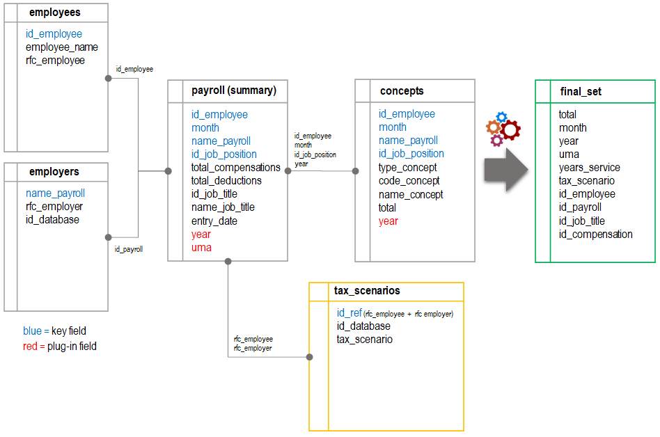
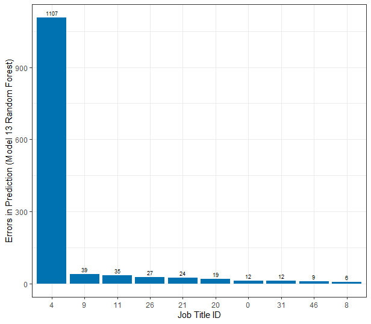

```{r setup, include=FALSE}
# Default options of all chunks in the document:
knitr::opts_chunk$set(echo = FALSE, warning=FALSE, message=FALSE, size = 10, out.extra = "")

# Requirements:
# 1. Download project from GitHub: https://github.com/rafaelyanlab/tax_expectation.git
# 2. Open project and run rmd (this file needs objects stored in rda/ and figs/ folder).   
```
\newpage

# Introduction.

In this paper we will analyze payroll historical data corresponding to three fiscal years (2017, 2018 and 2020) of a public entity and then we will apply Machine Learning (ML) to predict the total amount of income taxes based on a *profile* of each employee. For this purpose, we determine a *tax scenario* for each employee which ultimately will give us an estimate of *total taxation*. Hence, our ML algorithms will __predict tax scenarios__, which indirectly would help us to determine the total amount of taxes, similarly as in recommendation systems predicting ratings can lead us to recommend specific items to users.

The presented data was gathered as part of a real business case where I collaborated as a data science proffesional. This data was modified in order to prevent the disclosure of sensitive information. In this project we treated data differently depending on the time when we performed the analysis: 1). Closed fiscal years (2017-2019) and 2). Current fiscal year (2020, in that moment). The main goals of the project were to determine if income taxation were declared correctly, improve the original fiscal strategy and implement the new strategy in the current year.

During this project we realized that there were significantly differences between taxes paid during the year (the *tax estimates*) and the total amount of taxes calculated at the end of the year in the annual tax declaration (the *real taxes*), partly because the original method failed to predict correct *tax scenarios*. 

By the beginning of 2020, we focused on tax scenario prediction. First we improved (re-designed) the fiscal strategy and then we defined the algorithm to calculate *tax scenarios* accordingly. In this sense, *tax scenarios* can be thought as the __calculation mechanism__ or the way taxes would be determined. On the other hand, *compensations* are the input that feeds this mechanism (__calculation basis__) which ultimately determine how high taxation would be. Note that because we were on the current year, total compensations were unknown, thus we needed to estimate them in order to define the correct *tax scenario* for each employee.

To accomplish this, the client made a payroll projection which estimated the compensations that each employee would receive every single month. Practically, this consisted on generating all the payroll with "fictional data". It was then when our team leader sowed a seed of doubt: it should be a better and practical way to do so. This is where the idea of starting this paper came from. 

In __Section 2 Getting Started__, we explained some basics on the topic of payroll income taxation. In __Section 3 Data Wrangling__ we describe the datasets and variables, the main steps for cleaning, pre-processing and transforming this data as well as we describe some insights gained while exploring the data. In __Section 4 Methods and Analysis__ the reader will find the description of the metric used to evaluate the performance of the models, the considerations taken into account while creating train and test sets, as well as details of the ML algorithms implemented like K-Nearest Neighbors (KNN), Classification and Regression Tress (CART) and Random Forest, as some techniques like oversampling, k-fold cross validation, Principal Component Analysis (PCA) and ensembling. __Section 5 Results__ contains the results of all the trained algorithms. Finally, __Section 6 Conclusions__ gives a brief summary of the report, its potential impact, its limitations and future work. 

\newpage

# Getting Started.

## Payroll Income Taxation.

Before going further, let's explain some of the basics of payroll income taxation in Mexico. An individual who receive payroll compensations (employee) is subject to pay income taxes on all the taxable compensations defined by the Federal Law of Income Taxation (*Ley de Impuesto Sobre la Renta* in spanish), to which applicable rates are also defined by the aforementioned law.

```{r tax calculation, echo=FALSE, fig.cap="Income Tax Calculation", out.width="100%", out.height="100%", fig.show='hold', fig.align='center'}

```

An employer is responsible for deducting the income tax from every employee and then pay __every month__ the total accumulated taxes to the Tax Administration Service (or *SAT* by its acronym in spanish). However, the taxable base (total amount of taxable compensations) can be calculated at the __end of the year__ when all compensations are known to be paid. Thus, monthly tax payments are just an __estimate__ of the real tax which must be paid at the end of a year. Once a fiscal year ends, the employer must perform an annual tax calculation where the differences are settled.

Note that because of this effect, the differences at the end of the year may represent hundreds of millions, as in our case, depending on the size of an entity. This leads us to a cash flow problem, or even worst, a financial one due to a misrecognized liability.

Once we have realized of the importance of properly estimating taxes, we are ready to diagnose the key step to an accurate estimation ot taxation. The answer lies on the *taxable base*, since taxes are directly proportional to the total amount of taxable compensations. And this "proportion" depends on the applicable rates in a given year which are fixed. In other words, since applicable rates are fixed, tax estimates depends completely on taxable compensation estimates which varies per employee.

The next figure represents how taxable compensations (taxable base) are calculated:

\newpage

```{r taxable base, echo=FALSE, fig.cap="Taxable Base Calculation", out.width="100%", out.height="100%", fig.show='hold', fig.align='center'}

```

UMA stands for *"Unidad de Medida de Actualización"*, this is an economic reference (parameter) in mexican pesos which determines the amount of payment of obligations and assumptions established in federal laws.

Note that since *taxable base* depends on (b) and (c), and (c) depends on (a) and (b) then taxable base depends on (c) which is the *total taxable according to tax scenario*, or from now on, simply __tax scenario__.

From the figure above we can also realize that both tax scenarios 1 and 2 result in a zero taxable base of social security compensations. This means that even if there is a technical difference between them, we can treat both as the same scenario. Later on we will figure out that scenario 2 is the least common scenario in our data set while scenario 1 is the most common one. So, treating both as scenario 1 will definitely helps us to manage imbalance.


## Employee Profile.

The total amount of income taxes depends on *the nature of the compensations* and *the amount of compensations* received by each employee along the year. According to these compensations, a given employee can be categorized in one of four possible __tax scenarios__: 1, 2, 3 or 4. Each scenario determines, based on a yearly estimate of taxable compensations, the *calculation mechanism* we must perform on a monthly basis for a given employee in order to estimate the total amount of income taxes.

As we explained before, tax scenarios depend on social security and other compensations. But, at the same time, compensations depends on other important features like:

  __a. Base salary:__ Employees with lower salaries have on average lower compensations and employees with higher compensations have on average higher compensations. So maybe, some compensations could be adequately explained with just the base salary.

  __b. Job title or job position:__ Job titles have a compensation pattern. A clear example is occupational risk, some employees receive a special compensation due to occupational risk because of specific tasks required by their positions.

  __c. Length of service:__ Some compensations such as vacations and incentives for seniority depends on the years an employee has been in service.

  __d. Months effectively worked:__ There is a huge difference between two employees with same salary, same job position but different months effectively worked. For example, the accumulated salary per year of an employee who worked since january and that of another who started on october will vary significantly. 

The fact that compensations are related to these features is not due to chance but to the fact that normally there are terms of contract in which all working conditions are stated, thus, employees with similar terms of contract will receive similar compensations. It is due also to the fact that normally these working conditions depend on the responsabilities carried out by each position, for example, an executive manager could receive special compensations based on his position on the chain of command.

In this paper, we will refer to all these features as the __employee profile__.

## Tools and Resources.

This project can be downloaded from [this link](https://github.com/rafaelyanlab/tax_expectation.git). During the development of this project the following tools and resources were employed: 

* Programming Language: [R](https://www.r-project.org/).
* Integrated Development Environment (IDE): RStudio.
* Operating System (OS): Microsoft Windows 10 Home Single Language.
* System Type: x64-based PC.
* Processor: Intel(R) Core(TM) i7-7700HQ CPU @ 2.80GHz, 2801 Mhz, 4 core processors, 8 thread processors.
* Installed Physical Memory (RAM): 8.00 GB.
* Total Physical Memory: 7.83 GB.
* Available Physical Memory: 1.46 to 2.4 GB.
* Code Hosting Service: GitHub.

# Data Wrangling.

## Available Data.

```{r available_data, echo=FALSE, fig.cap="Available Data and Data Manipulation throughout the Project", out.width="80%", out.height="80%", fig.show='hold', fig.align='center'}

```

Our client is composed by eight different entities (employers from A to H) which are managed in two different data bases (1 and 2). Before project implementation, his original taxation model presented some issues which we will not discuss here. Thus, they hired our team to perform a diagnosis of the model and define a new taxation model. To do so, they provided us with the basic information in *csv files*. Because of the great amount of data, the fiscal specialist team couldn't analyze it with its usual software (Excel). So, I joined the team to facilitate data visualization (mainly with Power Pivot and Power BI). This allowed the fiscal specialist team to gain some insight and come with a solution.

The next step was to explain to our client how the new taxation model worked so it could implement the model internally (SQL). Therefore, we needed a way to validate the results of his model. To accomplish this, we used R to generate the new taxation model so we could be able to compare and validate the model implemented by the client. The calculations were easily shared in Excel files so we finally arrived to the same results.

The csv files provided by the client contains the results of processed queries and do not correspond to specific tables of the database, thus the information contained in this files is denormalized. The main files are:

  __1. Employers.__ This dataset contains the ID for each type of payroll payed by employer and the tax identification number of the employer (RFC by its acronym in spanish). An employer could have more than one type of payroll, so technically it is a table of types of payroll, but we will refer to it as the employer table. This table also contains an ID of the payroll database to distinguish between database 1 and database 2.

  __2. Employees.__ This dataset contains the basic information of employees, like: ID, name and tax identification number (RFC).

  __3. Payroll.__ This dataset contains a summary of the records for each employee per month, like: ID employee, month, ID payroll, total amount of  compensations, total amount of deductions, job_position, job title, name of job title, entry date.

  __4. Concepts.__ This dataset contains all compensations and deductions for each employee per month: ID employee, month, type of the concept (compensation or deduction), code of the concept, name of the concept and total amount of the concept.

The datasets provided contains information of years 2017, 2018 and 2020. There are one table per year for tables 2 to 4. On the other hand table 1 remains the same for the three years. Another available information, which is not provided by the client but was generated from the taxation model is:
  
  __5. Tax scenarios.__ This dataset contains and ID for each combination of RFC employee and RFC employer (field ID_Ref) which is the reference used to calculate taxes. It also contains the tax scenario and the ID of the payroll database of each ID_Ref^[An ID_Ref could be on database 1, database 2 or in both databases.].

## Data Pre-Processing.

Before creating our final set, the csv files where transformed as follows:
  
  1. Add year field to tables concepts.csv and append the files together.

  2. Add year and UMA fields to tables payroll.csv and append the files together. Add field for job tenure (years of service).

  3. Append employees.csv files together.

  4. Join payroll table and employers table by name_payroll.

  5. Join payroll table and employees table by id_employee and year.

  6. Add ID_Ref to payroll table (RFC employee + RFC employer).

  7. Join payroll table and tax scenarios table by ID_Ref.

  8. Join concepts table and payroll table by id_employee, month, year and id_job_position. If there were multiple records on the payroll table for the same employee in the same month in the same year with the same job position, we discarded those records before joining.

  9. Filter records with the following characteristics:
  
  * Only from payroll database 1 (we will use this sample to train the models).

  * Only compensations (since deductions does not affect taxation).

  * Only tax scenarios different from zero (since those correspond to special cases).

  10. Replace information of ID_Ref and name_payroll with an index to prevent the disclosure of sensitive information. Modify variable name to id_employee and id_payroll for better understanding.

  11. Filter out employees which have at least one record with job_title beginning with "J" or "N" (since those correspond to special cases: "J" = retired and "N" = Non-employees).

  12. Replace information of job_title with an index to prevent the disclosure of sensitive information. Modify variable name to id_job_title and keep only this variable.

  13. Concatenate type_concept and code_concept in a new variable called id_concept. Keep only the latter.

  14. Replace information of id_concept with an index to prevent the disclosure of sensitive information. Modify variable name to id_compensation and keep only this variable.

  15. Select only variables of interest: total, month, year, uma, years_service, tax_scenario, id_employee, id_job_title and id_compensation.

```{r relationship_queries, echo=FALSE, fig.cap="Data pre-processing", out.width="70%", out.height="70%", fig.show='hold', fig.align='center'}

```

\newpage

## Data Exploration^[This pdf section corresponds to section "I. Data Exploration" of the R script.].

### Features.

```{r load libraries}
if(!require(tidyverse)) install.packages("tidyverse", repos = "http://cran.us.r-project.org")
if(!require(stringr)) install.packages("tidyverse", repos = "http://cran.us.r-project.org")
if(!require(lubridate)) install.packages("tidyverse", repos = "http://cran.us.r-project.org")
if(!require(caret)) install.packages("caret", repos = "http://cran.us.r-project.org")

library(tidyverse)
library(stringr)
library(lubridate)
library(caret)
```

```{r load final set}
# This piece of code considers that you've already downloaded the entire project from GitHub:
final_set <- readRDS("rda/final_set.rda")
```

Our final set is composed by 10 columns or variables:
  
```{r structure}
str(final_set)
```

  1. total = value of compensation which is being paid.

  2. month = month of payroll.

  3. year = year of payroll.

  4. uma = "Unidad de Medida y Actualización" is an economic reference in mexican pesos which determines the amount of payment of obligations and assumptions established in federal laws (in this case is the reference to determine taxes). This value is updated every year and applies the whole year.

  5. years_service = years of service of an employee.

  6. tax_scenario = the __outcome__ we want to predict.

  7. id_employee = identifier of employees.

  8. id_payroll = identifier of the payroll. Despite there are five different payrolls, one per each employer, this variable is not id_employer, because an employer could have multiple types of payrolls. In this particular case the relationship is one to one.

  9. id_job_title = identifier of the job title of an employee.

  10. id_compensation = identifier of the concept of compensation that is being paid.

The following table shows a summary of our data set:

```{r summary}
summary(final_set)%>%
  knitr::kable(caption = "Final set summary.") %>%
  kableExtra::kable_styling(latex_options = c("striped","hold_position","scale_down")) %>%
  kableExtra::row_spec(0,bold=T)
```

In column *years_service* we can see there are 4 NA's and negative values which is inconsistent. So, we will eliminate all the records of those employees. Now our dataset has `r nrow(final_set)` observations and the summary by column is:

\newpage

```{r na negatives years_service}
discard_observations <- final_set %>%
  filter(is.na(years_service)) %>%
  distinct(id_employee)

final_set <- anti_join(final_set,discard_observations,by="id_employee")

discard_observations <- final_set %>%
  group_by(id_employee,year,years_service) %>%
  summarize(n=n()) %>%
  ungroup() %>%
  filter(years_service<0)

final_set <- anti_join(final_set,discard_observations,by="id_employee")
```

```{r corrected summary}
summary(final_set) %>%
  knitr::kable(caption = "Corrected final set summary.") %>%
  kableExtra::kable_styling(latex_options = c("striped","hold_position","scale_down")) %>%
  kableExtra::row_spec(0,bold=T)
```

The dataset has:

* `r count(final_set %>% distinct(id_employee)) %>% pull(n)` employees.
 
* `r count(final_set %>% distinct(id_compensation)) %>% pull(n)` types of compensations.
 
* `r count(final_set %>% distinct(id_job_title)) %>% pull(n)` job titles.

* `r count(final_set %>% distinct(id_payroll)) %>% pull(n)` types of payrolls (in this case, one per each employer).

* `r count(final_set %>% distinct(tax_scenario)) %>% pull(n)` tax scenarios (output).

### Feature Transformation.

So far, we ended up with 9 variables and 1 outcome. In theory, we could train algorithms with all these variables. Nontheless, we must remember that one of the goals of this project is to come with a practical model than simply payroll projection. Hence, we will focus on training a model with just a few information of the employee which we *know a priori* and we can *obtain easily*: the __employee profile__.

From this perspective, in our dataset, there are unknown features at the beginning of a given year like:
  
  * Compensation (*id_compensation*).

  * Total amount of payment (*total*).

  * Month of payment (*month*).

There could be many combinations of these three variables. Hence, to simplify these features, we will just consider the average base salary paid in a year as part of the employee profile. Note that we are trading-off accuracy for simplicity.

There is another feature which has an special treatment: Year of payroll (*year*). Despite we know this value *a priori*, in this particular case  *year* is not relevant to the calculations of tax scenarios *per se*. It is only necessary to determine the value of the *uma* feature. UMA value is updated and published every year. The reason I kept the variable *year* in the set is because in practice it is very useful as a referral since every stakeholder in the project uses it intuitively, as opposed to the UMA:

```{r uma per year}
final_set %>%
  distinct(year,uma) %>%
  knitr::kable(caption = "Value of UMA per year.") %>%
  kableExtra::kable_styling(latex_options = c("striped","hold_position")) %>%
  kableExtra::row_spec(0,bold=T)
```

In order to train our model we will summarize the first 3 features we previously described (id_compensation, total, month) into two values per employee:

__1. The average base salary:__ Which will account for most of the variability due to other compensations. On the other hand, the variability due to those compensations that depend on the lenght of service will be accounted by our feature "years_service".

__2. The months effectively paid:__ Note that I used the word "paid" and not "worked" since there are employees who have more than one job position in the same period. So this variable would account the effect of accumulative salary.

All the employees with more than one job title will be summarized per *id_employee* per *year* and *job_title* would be set as 0 (non available). But, since job title is relevant to our model, we would apply a "job title + average salary" approach to employees with 1 job title and a "just average salary" approach to employees with more than one job position.

One last step we will do is convert tax scenario 2 into tax scenario 1, since both result in a zero taxable base of social security compensations (see Figure 2 Taxable Base Calculation).

After these transformations, our modelling set looks like this:
```{r modelling_set}
final_set <- readRDS("rda/final_set_transformed.rda")

head(final_set,n=10) %>%
  knitr::kable(caption = "Modelling set.") %>%
  kableExtra::kable_styling(latex_options = c("striped","hold_position","scale_down")) %>%
  kableExtra::row_spec(0,bold=T)
```

The features we will use for fitting models in this project are:
 
  1. id_job_title
  2. paid_months
  3. average_salary
  4. uma
  5. years_service
  6. id_payroll

The variables that we will leave out of the models are:

  1. id_employee: even though this variable could be relevant it is not useful to our model since we don't want to predict tax scenarios based on who the employee is (as a subject) but based on his profile.
  2. year: as we said before, year is important as a universal referral.

Our outcome will be:

  1. tax_scenario

### Relationship between Features and Output.

We have transformed our data into six features. We know that some of these features are numerical and some others are categorical. We also know that our outcome is categorical. Hence, we have two combinations according to the type of data. We will perform a specific statistical test for each case to confirm that our predictors have a significant relationship with tax scenarios:

 * __Categorical outcome and categorical feature.__ In this case we will perform a *chi-squared* test. The features included in this group are id_job_title and id_payroll. This test will tell us if tax scenarios differ across the categorical features and if these differences are significant. Greater differences between expected and actual data produce a larger chi-squared value. The larger the chi-squared value, the greater the probability that there really exists a significant difference, and thus that our outcome and features are dependent.

The following figures shows the relationship between each categorical feature and the outcome as well as the p-value of the chi-squared test:
```{r chi_squared, echo=FALSE, fig.cap="Categorical Features and p-value of Chi-Squared Test", out.width="80%", out.height="80%", fig.show='hold', fig.align='center'}

```

Note that the p-value is less than 0.05, hence, there is a significant difference between our categorical features and the tax scenarios.

 * __Categorigal outcome and numerical feature.__ In this case we will perform an *ANOVA* test. The features included in this group are paid_months, average_salary, uma and years_service. ANOVA tells us whether any of the tax scenario means are different from the overall mean of the data by checking the variance of each tax scenario against the overall variance of the data. If one or more tax scenarios falls outside the range of variation predicted by the null hypothesis (all group means are equal), then the test is statistically significant, and thus there is a difference in the values of the features between each tax scenario.

The following figures shows the relationship between each numerical feature and the outcome as well as the p-value of the ANOVA test:

\newpage

```{r anova, echo=FALSE, fig.cap="Numerical Features and p-value of ANOVA Test", out.width="80%", out.height="80%", fig.show='hold', fig.align='center'}

```

Note that the p-value is less than 0.05, hence, there is a significant difference between the feature mean of each individual tax scenario and the feature mean of the whole data.

# Methods and Analysis.

## Evaluation of the Model.

In order to evaluate the performance of our model, we have to choose an appropriate metric. While a loss function such as RMSE^[Root Mean Square Error] is more suitable for numerical outcomes, there are other metrics which are more suitable for categorical outcomes, as in our case. To illustrate some of these metrics we will use the following __confusion matrix__ as an example^[Note that both matrices in the figure are the same, but the possible results are shown from different point of view: the matrix on the left considers tax scenario 1 as the pivot while the matrix on the right considers tax scenario 3 as the pivot. With this information, results for tax scenario 4 can be easily infered.]:

```{r confusion_matrix, echo=FALSE, fig.cap="Confusion Matrix", out.width="90%", out.height="90%", fig.show='hold', fig.align='center'}

```

A confusion matrix is a matrix with all possible combinations of predictions and true values. These combinations leads to four possible results:

* True Positives (TP).
* False Positive (FP).
* False Negative (FN).
* True Negatives (TN).

Once we know which are the possible results, we can describe some of the most relevant performance metrics:

* __Precision.__ Measures the proportion of predicted positives that are truly positive. In  our example considering tax scenario 1, *precision* is 83.04%, this means that from all predictions of scenario 1 (4411 + 0 + 901 = 5312), the 83.04% were predicted correctly as scenario 1 (4411).
$$
Precision = \frac{TP}{(TP + FP)}
$$

* __Recall.__ Measures the proportion of predicted positives made out of all the truly positives. In  our example considering tax scenario 1, *recall* is 88.20%, this means that from all observations of scenario 1 (4411 + 65 + 525 = 5001), the 88.20% were predicted correctly as scenario 1 (4411).
$$
Recall = \frac{TP}{(TP + FN)}
$$

* $F_{1}-score$. Measures the average of specificity (precision) and sensitivity (recall). As explained by Rafael Irizarry in his book Introduction to Data Science: *"Because specificity and sensitivity are rates, it is more appropriate to compute the harmonic average. In fact, $F_{1}-score$, a widely used one-number summary, is the harmonic average of precision and recall"* (Irizarry, 2020, p. 481). In $F_{1}-score$, one way to weight specificity and sensitivity is by adding a parameter $\beta$ which represents how much more important is sensitivity over specificity. The next equation defines $F_{1}-score$ with $\beta=1$, which means that sensitivity and specificity are equally important: 
$$
F_{1(\beta=1)} = 2*\frac{precision . recall}{precision + recall}
$$

In  our example considering tax scenario 1 and $\beta = 1$, *$F_{1(\beta=1)}$* is 85.54%, this means that the harmonic average between precision (83.04%) and recall (88.20%) is 85.54%.

The next equation is a general form which considers a weighted harmonic average with parameter $\beta$:
$$
F_{1(\beta=0.5)} = \frac{1}{\frac{\beta^2}{1+\beta^2}\frac{1}{recall}+\frac{1}{1+\beta^2}\frac{1}{precision}}
$$

In  our example considering tax scenario 1 and $\beta = 0.5$, *$F_{1(\beta=0.5)}$* is 84.02%, this means that the harmonic average between precision (83.04%) and recall (88.20%) considering that precision is twice as important as recall, equals 84.02%.

* __$Accuracy$.__ Measures the total predicted positives and predicted negatives out of the total observations.
$$
Accuracy = \frac{TP + TN}{n}
$$
where, n = number of observations.

In our example, accuracy is 89.22%, this means that all the true predicted scenarios (4411+4893+3983) represents the 89.22% of all observations (14892).

So, which metric should we use? That depends on the error we are willing to tolerate in our model. As explained by Boaz Shumueli in his article [Multi-Class Metrics Made Simple, Part I: Precision and Recall](https://towardsdatascience.com/multi-class-metrics-made-simple-part-i-precision-and-recall-9250280bddc2): *"There’s usually a trade-off between good precision and good recall. You usually can’t have both."* (Shmueli, B., 2019). And those metrics measures entirely different things. For instance let's consider the next examples:

1. If we predict scenario 3 or 4 and the true scenario is 1, then the *taxable social security base* would be overestimated (see Figue 2 "Taxable Base Calculation"), since scenario 1 has a taxable base of zero and scenarios 3 and 4 has taxable base greater than zero (specially scenario 4). This means that, at the end of the year, we would realize that we've payed more taxes than due, so we can claim a credit for overpaid taxes. Despite this is an error, it is certainly not that bad.

2. If we predict scenario 1 and the true scenario is either 3 or 4, then the *taxable social security base* would be underestimated. This means that, at the end of the year, we would need to pay taxes we didn't expect or plan to pay and that would be bad. This is something we want to avoid. In other words, this is an error we are not willing to tolerate.

In our first example we are measuring sensitivity or *recall* (true positive scenarios 1 over all scenarios 1). In our last example we are measuring specificity or *precision* (predicted scenarios 1 that are truly scenarios 1). Thus, if we think of the cost of making a wrong prediction we would prefer precision over recall. In other words, if we define a *cost function* precision should be weighted with greater cost than recall.

Now, considering that recall is also important, maybe an appropriate metric for this project would be $F_{1}-score$ with $\beta < 1$, in this case we will consider $\beta =0.5$. Note that this metric is computed for each category so a one-digit summary of performance of the whole model can be the Macro $F_{1}-score$ which is the simple average of all $F_{1}-scores$:

$$
MacroF_{1} = \sum_{c=1}^{n}\frac{F_{1c}}{n}
$$
where:

$c$ = output class.

$n$ = total number of classes.

This is the metric we will use to determine the performance of our model.

## Model Treshold.

By the end of 2020, we were able to compare the *tax scenarios* of that year based on the payroll projection and the *true tax scenarios*. The following figure shows the results and metrics of this projection:

```{r projection, echo=FALSE, fig.cap="Confusion Matrix", out.width="40%", out.height="40%", fig.show='hold', fig.align='center'}

```
  
As we can see, the projection was really accurate resulting on a Macro $F_{1}-score$ of 94.81%. This means that our algorithm could be consider as good as the payroll projection, insofar as it gets closer to this treshold.

## Accuracy Paradox.

As explained by Tejumade Afonja in his article [Accuracy Paradox](https://towardsdatascience.com/accuracy-paradox-897a69e2dd9b): *"Accuracy Paradox for Predictive Analytics states that Predictive Models with a given level of Accuracy may have greater Predictive Power than Models with higher Accuracy"* (Afonja, T., 2017). In this article, the author illustrates an example of a model for breast cancer detection, which has an accuracy of 90% but precision and recall of 0%. This means that the model will always classify any observation as “no breast cancer”. It failed to predict any case of breast cancer.

This behavior usually occurs in imbalanced datasets, which means that the proportion of classes are uneven, so a ML algorithm will tend to predict based on the majority class. In the example above, if there are 300 patients of which only 30 have cancer a ML algorithm will assign the 270 no-cancer patients more weight than to the 30 cancer patients. That is why it is call a "paradox": even when accuracy is pretty high, the predictive power of the model seems to be pretty low.

In our dataset there is a clear imbalance among classes:
```{r imabalanced_dataset}
final_set %>%
  group_by(tax_scenario) %>%
  summarize(n=n()) %>%
  knitr::kable(caption = "Frequency of classes in the dataset.") %>%
  kableExtra::kable_styling(latex_options = c("striped","hold_position")) %>%
  kableExtra::row_spec(0,bold=T)
```

One way to deal with imbalanced datasets is __resampling__ wich means changing the dataset to have more balanced data. Jason Brownlee in his article [8 Tactics to Combat Imbalanced Classes in Your Machine Learning Dataset](https://machinelearningmastery.com/tactics-to-combat-imbalanced-classes-in-your-machine-learning-dataset/) explains the two main methods of resampling:

*"1. You can add copies of instances from the under-represented class called over-sampling (or more formally sampling with replacement), or
2. You can delete instances from the over-represented class, called under-sampling."* (Brownlee, J., 2015).

A downside of under-sampling is the loss of potentially useful data while a downside of over-sampling is that it makes over-fitting more likely since it is generating exact copies of existing observations. In this case, we decided to over-sampling our final dataset:

```{r balanced_dataset}
balanced_final_set <- readRDS("rda/balanced_final_set.rda")

balanced_final_set %>%
  group_by(tax_scenario) %>%
  summarize(n=n()) %>%
  knitr::kable(caption = "Frequency of classes in balanced dataset.") %>%
  kableExtra::kable_styling(latex_options = c("striped","hold_position")) %>%
  kableExtra::row_spec(0,bold=T)
```

## Train and Test Sets.

Once we balanced our final dataset, we splitted the set into train and test set:

* __train_set:__ Since the number of observations in the whole data set is large then any division may work fine, thus, we chose the 80% of the data of each year and each tax scenario.

* __test_set:__ contains the remaining 20% of the data of each year and each tax scenario. Here, we checked for observations with feature values that weren't present on the train set, discarded them from this set and add them back to the train set.


## Models Implemented.

In general, in classification models we estimate the conditional probability of having an outcome $Y$ given values $x_1$, $x_2$ or $x_n$ for each selected predictor $X_1$, $X_2$ or $X_n$:

$$
Pr(Y = 1 | X_1=x_1, X_2=x_2)
$$

The methods that we have used to train our models are the followings:

1. __K-Nearest Neighbors.__ In this method, we define the *distance* between each observation in the training set. Each observation represents a point ($x_1$,$x_2$,$x_n$), where *n* is the dimension of the data and it is given by the number of predictors (features) in the dataset. A two-dimensional data would be a two-feature model, a three-dimensional data would refer to a three-feature model, and so on. Then, we select *K* points in the train set which are closest to the test set and calculate the probability of the test data belonging to one of the possible classes (i.e. tax scenarios). The class with the highest probability is selected as the prediction for each observation. In regression models, the prediction is the mean of the *K* selected points. One downside of KNN is its lack of interpretability when dealing with multi-dimensional data. Because of this, we also performed Principal Component Analysis (PCA) together with KNN. PCA is a technique of __dimensionality reduction__, where a high proportion of total variance in the dataset can be accounted in just a few Principal Components (PCs), hopefully in the first two or first three components so that we can plot the results.

2. __Classification and Regression Trees (CART).__ Decision trees applies to both categorical (classification) and numerical (regression) data. Overall, the tree stratifies the observations into different and non-overlapping regions of predictor space. As in KNN, the class with the highest probability is selected as the prediction for each observation. An upside of decision trees is that they *"can be displayed graphically, and are easily interpreted even by a non-expert, [...] some people believe that decision trees more closely mirror human decision-making than do (other) regression and classification approaches"* (James, G. et al., 2017, p. 315). A downside of decision trees is that they might not have the same predictive power than some other approaches. *"Additionally, trees can be very non-robust. In other words, a small change in the data can cause a large change in the final estimated tree"*(James, G. et al., 2017, p. 316)^[James, G., Witten, D., Hastie, T., & Tibshirani, R. (2017). *An introduction to Statistical Learning with Applications in R*. Springer.].

3. __Random Forest.__ This method *"addresses the short-comings of decision trees using a clever idea. The goal is to improve predictions preformance and reduce instability by averaging multiple decision trees (a forest of trees constructed with randomness)"* (Irizarry, R., 2020, p. 566)^[Irizarry, R. (2020). *Introduction to Data Science: Data Analysis and Prediction Algorithms with R"*. CRC Press.]. Because averaging a set of observations (or in our case the majority vote) reduces variance, this method uses bootstrap aggregation or bagging which consist in taking many training sets from the population, in order to build a separate prediction model using each training set. An upside of random forests is that they are procedures with low variance in contrast with single decision trees which suffer from high variance. A downside of random forests is their lack of interpretability.

For each method we predicted tax scenarios in three different ways depending on the feature *id_job_title*:

1. Considering id_job_title for all observations.

2. Without considering id_job_title for any observation.

3. Considering id_job_title for certain observations: if an employee has more than one job title (job position) in the same year, we predicted the tax scenario __without considering__ this feature. Otherwise, we predicted the tax scenario __considering__ this feature.

All models were trained using __k-fold Cross-Validation__. Cross-validation, as explained by Jason Brownlee in his article [A Gentle Introduction to k-fold Cross-Validation](https://machinelearningmastery.com/k-fold-cross-validation/): *"is a resampling procedure used to evaluate machine learning models on a limited data sample"* and *"(it) is primarily used in applied machine learning to estimate the skill of a machine learning model on unseen data"* (Brownlee, J., 2020).

In this technique, we split the train set in *k* folds of which we use *k - 1* folds to train an algorithm and the remaining *k* fold is used to evaluate the fited model. Then, we alternate one fold at a time until we evaluate the model in each fold. This way we *"estimate how the model is expected to perform in general when used to make predictions on data not used during the training of the model"* (Brownlee, J., 2020).

Another technique implemented in this project was __ensembling__. This means that, for each observation on the test set, we take into account the predictions of several models, so the final prediction of the ensemble is the most common class of these models. Thus, the performance of the model is often improved due to the evaluation of multiple algorithms. Two types of ensembles were trained:

1. An ensemble of all the trained models (multiple models of the same method).

2. An ensemble of one of each method implemented (one of each KNN, CART, PCA+KNN and Random Forest method).

# Results.

The following table summarizes the results of the models implemented:

```{r model_results}
model_results <- readRDS("rda/model_results.rda")

rownames(model_results) <- NULL

model_results %>%
  knitr::kable(caption = "Final results of trained models.") %>%
  kableExtra::kable_styling(latex_options = c("striped","hold_position","scale_down")) %>%
  kableExtra::row_spec(0,bold=T)
```

* __ID.__ Is the mumber of the ML algorithm implemented.

* __Method.__ Indicates the approach of the model implemented.

* __Accuracy.__ Also known as Micro $F_1$, it is a performance metric which 

* __Macro_F1.__ Represents the simple average of $F_1$ score of each class. $F_1$ score was calculated as an harmonic average of precision and recall with $\beta = 1$, this means, precision is as important as recall.

* __Macro_F1_weighted.__ Represents the simple average of $F_1$ score of each class. $F_1$ score was calculated as an harmonic average of precision and recall with $\beta = 0.5$, this means precision is twice as important as recall. The term "weighted" refers to the difference on the ponderation of these to metrics.

* __Parameters.__ Refers to the best tuned parameter of each model. "cp" stands for complexity parameter, "mtry" means randomly selected predictors.

* __Description.__ Contains a short explanation of the model implemented.

The metric used to evaluate the performance of our models is __Macro_F1_weighted__. As shown in the table above, decision trees presented the poorest performance, as opposed to KNN and Random Forest which seemed to perform quiet well.

However, KNN and Random Forest are the least interpretable models, since they cant't be easily visualized, as opposed to decision trees. The following is an image of a classification tree model (model 4):  

```{r CART_results, echo=FALSE, fig.cap="Visualization of Model 4 (Classification Tree)", out.width="100%", out.height="100%", fig.show='hold', fig.align='center'}

```

As we can see, theres is a clear way to interpret how different values in the features lead to each tax scenario. Another cases of high interpretability are the models where PCA was implemented to reduce dimensions:

\newpage

```{r pca_3d, echo=FALSE, fig.cap="Visualization of Model 10 (PCA + KNN)", out.width="80%", out.height="80%", fig.show='hold', fig.align='center'}

```

In the figure above we have plotted the observations seen from the first three Principal Components. The upper plots represents the same data seen from different angles. In the lower plots a vertical line from the observation (point) to the base of the plane was added in order to facilitate the exact location of the observations in the space. Note how many points of tax scenario 1 and tax scenario 4 seems to overlap in the same space, which make these scenarios difficult to predict. This effect can be noticed in the confusion matrices:

```{r cm_examples, echo=FALSE, fig.cap="Examples of Confusion Matrices", out.width="55%", out.height="55%", fig.show='hold', fig.align='center'}

```

\newpage

By analyzing the results of model 13 (random forest), we can realize that more than 80% of the errors described in our confusion matrix corresponds to one single job title (ID = 4). This basically tells us that if we want to improve our results, a deeper analysis on the behavior of id job title 4 might be crucial: 

```{r errors, echo=FALSE, fig.cap="Top Ten Job Titles with more Prediction Errors", out.width="90%", out.height="90%", fig.show='hold', fig.align='center'}

```

PCA is also useful to visualize the importance of the features in the model. The farther the variable is from the center, more relevant is for the Principal Component. In this sense, we can see that average_salary and id_job_title are very important to PC 1 as years_service and id_payroll are to PC2 and paid_months and id_payroll are to PC3:

\newpage

```{r pca_var_imp, echo=FALSE, fig.cap="Variable Importance in PC1, PC2 and PC3", out.width="100%", out.height="100%", fig.show='hold', fig.align='center'}
knitr::include_graphics("figs/pca_var_imp.png")
```

If we compare the performance metric of our models to the performance treshold obtained from the payroll projection of 2020 (See Section 4.2 Model Treshold), we can see that our best models performs 3.87%-4.88% lower than the payroll projection:

```{r comparative_metris, echo=FALSE, fig.cap="Differences between Performance Treshold and Models' Performance", out.width="90%", out.height="90%", fig.show='hold', fig.align='center'}

```

\newpage

# Conclusions.

After training fifteen Machine Learning models we were able to predict tax scenarios with an accuracy between 89.93% and 90.94% (according to our best results). It is important to mention that, in this case, the term "accuracy" was measured with a metric called Macro $F_1$-score, which is an average of precision and recall. While calculating $F_1$-scores, we defined the parameter $\beta = 0.5$, to assign more weight to precision over recall. The main reason why we decided this value for parameter $\beta$ is based on the error we were willing to tolerate in our model. An error in precision would have a greater cost than an error on recall. Nevertheless, analyzing distinct performance metrics we could realize that the difference between them is marginal.

At the end of 2020, we were able to validate a prediction of tax scenarios that were made based on a payroll projection. The accuracy of this method was pretty high (94.81%) but certainly not flawless. So, if we compare this treshold with the results of our best algorithms, we find out that our trained models performed just between 3.87% and 4.88% lower than the payroll projection.

Despite the performance of our best models is not far from the payroll projection treshold, I'd expected a higher performance since tax scenarios are calculated with specific criteria (what we described as *calculation mechanism*) which has remained the same at least in the period of time that we were analyzing. For this reason, we can infer that the cause of this effect doesn't relies on the *calculation mechanism* but on the *calculation basis*, in other words, on the compensations that feeds the *calculation mechanism*. So, I can think of two main reasons of why this happend:

* Features not considered in our dataset which could allow the model to better distinguish between tax scenarios, for example: hierarchies among job title (or job position), geographic location (what we called "economic zones"), workplace (i.e. office, school, congress), etc.

* A non homogeneous plan of compensations for a same stratum of employees, which could lead us to pose new questions as: are compensations equally distributed? is there a kind of preferentism towards a group of people?

Nonetheless, there is another important component in our project goal to be consider, and that is simplicity. If we end up with an algorithm that manages to predict tax scenarios with few basic and easy-to-get features (as we did) rather than making a whole payroll projection, that would be better since our model would be very interpretable. Note that there is a trade-off between accuracy and simplicity, normally when the first one increases the last one decreases, and vice versa. This would be more like a qualitative parameter. In this case, we were able to predict tax scenarios based only on an *employee profile* which consist on four variables:

* Base salary.
* Job title or job position.
* Lenght of service.
* Months effectively worked by the end of the year.

Aditionally we take into account two exogenous variables to the employee profile, which are:

* UMA, an economic reference in mexican pesos which determines the amount of payment of obligations and assumptions established in federal laws.
* Type of payroll, which depends on the way a payroll is managed.

The methods that presented the best performance were __random forests__ and __K-nearest neighbors__. However, these methods are not easily interpretable. This is the reason why we also trained __classification trees__. Unfortunately, even when implemented different algorithms for decision trees, the performance of the models was pretty low.

A way we enhanced interpretability was implementing __Principal Component Analysis (PCA)__ to transform the original data to a three-dimensional dataset and then perform K-nearest neighbors to this transformed set. The accuracy of this kind of models where very similar to those achieved by performing KNN in the original dataset. On the other hand, a way to enhance accuracy was to __ensemble__ multiple models. 

One of the biggest challenges of this project was to extract, load and transform the available information. As opposed by case-studies presented on the course, the data in a real life project could be really messy and difficult to manage. Hence, good skills of data wrangling and analytical thinking are a key factor to succeed in implementing machine learning models.

This real case project I collaborated with has a special meaning to me since it was my first-hand experience in data science: from data engineering, through business intelligence to business analytics. With this project I was able to move from small data to big data tools, specially R programming. Now, it helps me too to present this paper to hopefully earn a *HarvardX's Data Science Professional Certificate*.

The main impact of this project is that settles the foundations to develop a more effectively and efficently methodology to implement in future projects. As future steps, we can think of analyzing new features, train new algorithms and build an interactive app, perhaps with Power BI or Shiny R.